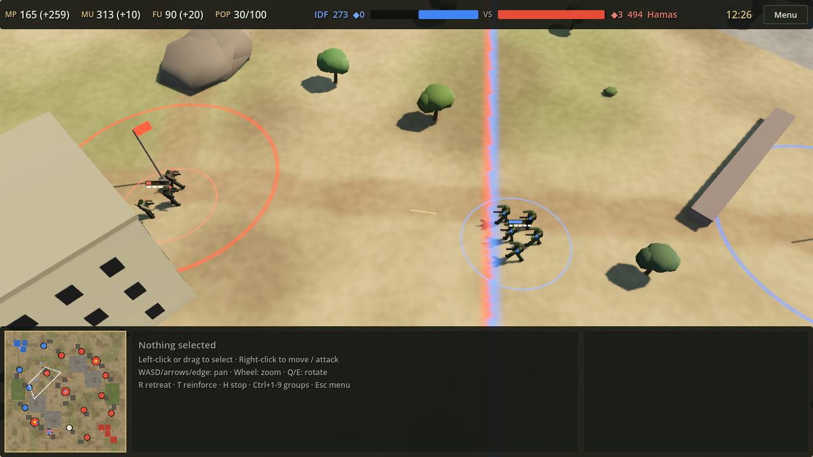
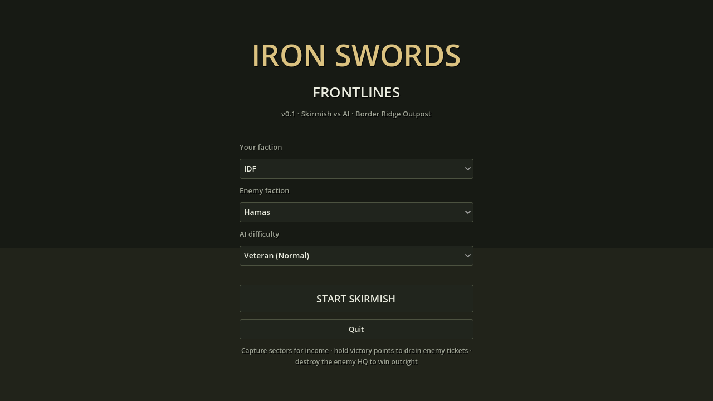
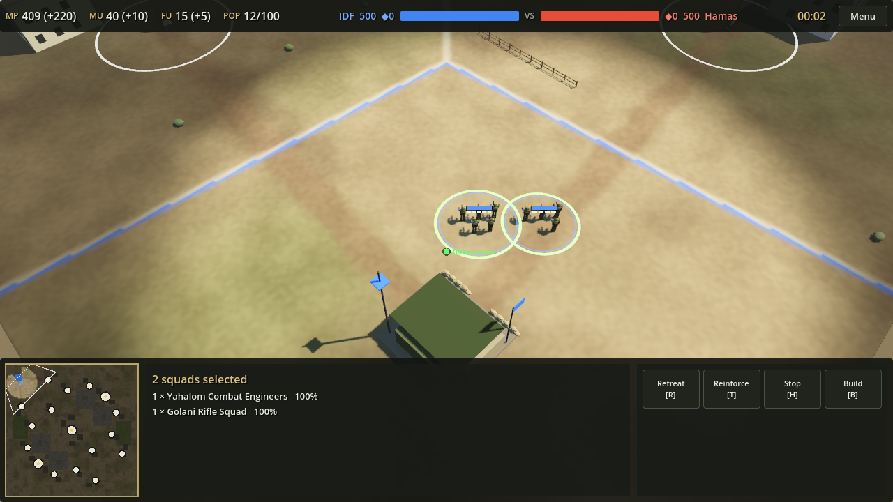
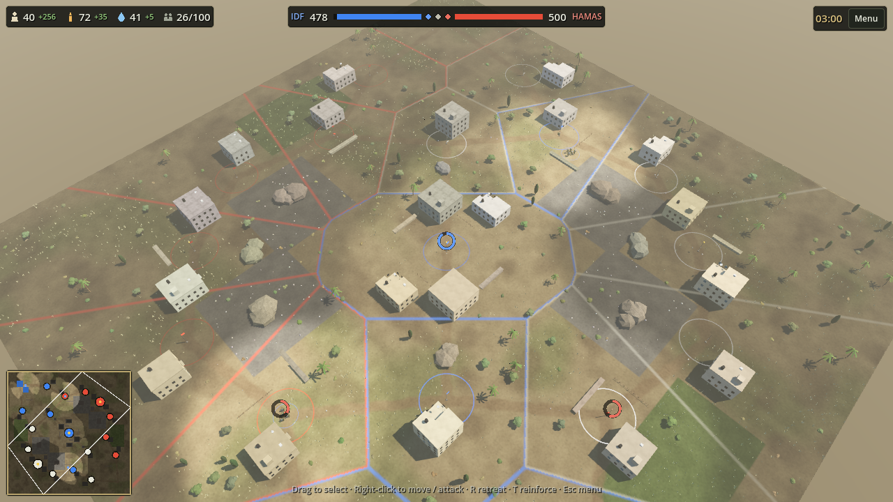
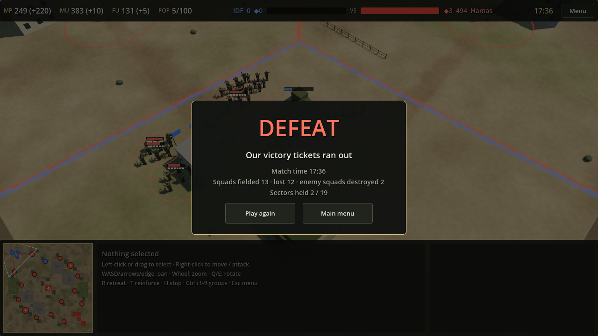
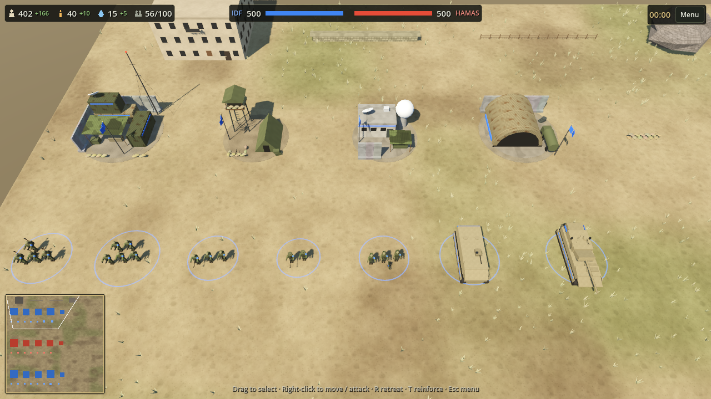
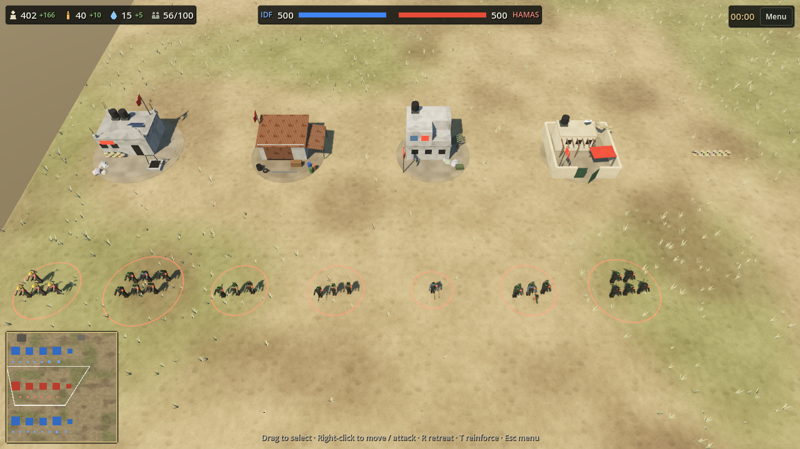
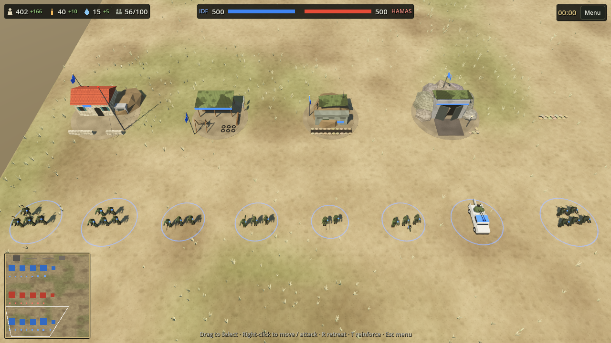

# Iron Swords: Frontlines (codename OCT7)

A squad-based tactical RTS in the Company of Heroes tradition, set in modern Middle East warfare. It has three asymmetric factions:

| Faction | Identity | Signature systems |
|---|---|---|
| **IDF** | Precision & combined arms | Merkava + Trophy APS, Iron Dome, Intel-driven air strikes, K9 & drones |
| **Hamas** | The Underground | Tunnel network, ambush & stealth, IED/EFP, rockets, quadcopters |
| **Hezbollah** | Defense in depth & firepower | Kornet ATGMs, fortified hills, Rocket Stockpile, layered anti-air |

> **Working title** *Iron Swords: Frontlines* is a placeholder.



## Status
**v0.1 (first playable skirmish) is done.** You can play a full 1v1 match against the AI as any of the three factions.
- **Match flow:** pick your faction, the enemy faction and the AI difficulty (Easy / Normal / Hard). Build with engineers, produce squads and vehicles, capture sectors, and fight. You win on VP tickets or by destroying the enemy HQ.
- **Combat model:** CoH-style:
  - Accuracy by range band and directional cover, both automatic (building and wall edges) and engineer sandbags.
  - Suppression and pinning, retreat and reinforce, vehicle front and rear armor, fog of war with line of sight.
- **Art:** procedural low-poly models in a faceted style, with procedural animation.
  - Each faction has its own building set (IDF containers and T-walls, Hamas concrete and rebar, Hezbollah limestone, earth berms and tunnels).
  - Units have role-specific gear: engineers' packs, MG bipods, sniper ghillies, AT launchers and spare rockets.
  - Effects include smoke, fireballs, debris, scorch marks and tracers.
  - The map has olive trees, cypresses, palms and grass.
  - The HUD is compact, with icon command cards.
- **Sound:** basic positional battle sounds synthesized in code: rifles, machine guns, snipers, cannons, rocket launches and explosions. There's a sound test and a volume slider in the main menu; see [Test the sounds](#test-the-sounds).
- **Under the hood:** a deterministic C# simulation, 93 unit tests, and an AI-vs-AI MatchRunner that verifies determinism across all 9 matchups. CI runs a full headless match in the real game.

Next: playtesting, a balance pass, then the signature systems (tunnels, Iron Dome, Trophy, Intel), veterancy, heroes and doctrines. See [docs/09](docs/09-production-roadmap.md).

| | |
|---|---|
|  |  |
|  |  |

Every faction has its own building and unit designs. These shots come from the art gallery, launched with `--showcase all`:

| IDF | Hamas | Hezbollah |
|---|---|---|
|  |  |  |

## Download and play (Windows)
Every push that passes CI publishes a ready-to-run build, so no Godot or .NET install is needed.
1. Download **[OCT7-windows.zip](https://github.com/rapidgilad/OCT7/releases/latest/download/OCT7-windows.zip)** (log in to GitHub first; the repo is private). All builds are listed on the [releases page](https://github.com/rapidgilad/OCT7/releases/tag/dev-latest).
2. Extract it anywhere, e.g. `C:\Games\OCT7`, and run `OCT7.exe`. The build isn't code-signed, so if SmartScreen warns, click **More info → Run anyway**.
3. The main menu shows the build number (commit) under the title.
4. Extra launchers in the folder:
   - `AI battle.bat`: watch the AI fight itself.
   - `Gallery.bat`: every unit and building.
   - `Effects test.bat`: explosions, fire, tracers and rockets on a loop.
   - `Play (safe graphics).bat`: for older or integrated GPUs.

Every CI run also stores the Windows and Linux zips as workflow artifacts for 30 days.

## Getting started

### Play a skirmish locally
1. Install **Godot 4.5.1 .NET** (the ".NET" download, not the standard one) and the **.NET 8 SDK**.
2. Open `game/project.godot` in Godot, then press **F5**. Pick factions and difficulty, then click **Start skirmish**.
3. Controls:

   | Input | Action |
   |---|---|
   | WASD / arrows / screen edge | Pan |
   | Mouse wheel | Zoom |
   | Q / E | Rotate |
   | Left click / drag | Select (double-click: all of that type on screen) |
   | Shift + click | Add to selection |
   | Ctrl + A | Select all your squads |
   | Ctrl + 1–9 / 1–9 | Assign / recall control group |
   | Right click | Context order: move (snaps to cover), attack, help build; with a building selected, set rally point |
   | R / T / H | Retreat / reinforce / stop |
   | Command card | Build menu (engineers) and production (buildings); each button shows its hotkey |
   | Space | Rotate a structure while placing it |
   | Minimap | Left click / drag: jump the camera. Right click: move the selected squads |
   | Esc | Cancel placement, clear selection, or open the pause menu (resume / surrender / main menu) |

   The cursor preview shows cover at the destination: **green** heavy, **yellow** light, **red** open.

### Test the sounds
1. **Sound test.**
   - Launch the game (F5). In the main menu, click **Rifle, MG, Sniper, Cannon, RPG, Boom** under *Sound test*.
   - Each click plays the next variant: rifles and MGs have 4, the others 2–3.
   - Adjust **Volume** if needed. The setting is saved.
2. **In a match.**
   - Start a skirmish and move your riflemen toward the enemy. Sounds play only for fights you can see.
   - Sounds are positional: louder near the screen center, panned left/right, and quieter as you zoom out.
3. **Watch the AI fight** without playing.
   - Command line: `godot --path game -- --demo --fast-forward 6000 --focus-army`. The AI plays both sides, and the camera opens on a firefight about 10 minutes in.
   - From the editor: **Debug → Customize Run Instances… → Main Run Args**, enter `--demo --fast-forward 6000 --focus-army`, then press F5.
   - For tanks, RPGs and explosions, use `--p0 hamas --p1 idf --fast-forward 9600`.
4. **Listen outside the game.**
   - Run `godot --headless --path game -- --export-sounds ~/oct7-sounds`. It writes every variant as a WAV (e.g. `rifle_1.wav`, `explosion_3.wav`) for any audio player.
5. **Swap in real recordings.** Put `rifle.wav`, `machine_gun.wav`, `sniper.wav`, `cannon.wav`, `rocket_launch.wav` or `explosion.wav` (or `.ogg`) into `game/assets/audio/`. Let the Godot editor import them and they replace the synthesized sounds. The tooltip on each sound-test button says which one is active.

### Develop (locally or in Claude Code cloud sessions)
```bash
dotnet build OCT7.sln                                    # sim + tests + tools + game assembly
dotnet test tests/OCT7.Sim.Tests                         # unit tests
dotnet run --project tools/MatchRunner -- --matches 20 --verify-determinism   # AI-vs-AI batch
godot --headless --path game -- --smoke-test 600         # run the real game headless
godot --headless --path game -- --smoke-test 30000 --full-match   # full AI-vs-AI match, must end in a victory
godot --headless --path game -- --export-sounds /tmp/sounds        # write the synthesized SFX as WAV files
```
In Claude Code cloud sessions, `.claude/hooks/session-start.sh` installs .NET 8, Godot and the software renderers automatically, so Claude can build, test, run and **screenshot** the game. Project rules for Claude are in [CLAUDE.md](CLAUDE.md).

### Repository layout
| Path | Contents |
|---|---|
| `sim/` | All game rules. Pure C#, no engine references, deterministic |
| `tests/` | xUnit tests for the sim |
| `tools/MatchRunner/` | Headless AI-vs-AI batch runner |
| `game/` | Godot project (presentation only) |
| `game/data/` | All balance data (JSON) |
| `docs/` | Game design documents (source of truth) |

## Solo V1 at a glance
- **Mode:** 1v1 skirmish vs AI. Three difficulty levels: **Easy (Recruit) / Normal (Veteran) / Hard (Elite)**.
- **Factions:** all three, with about 10 units each. IDF vs Hamas is built first, then Hezbollah.
- **Base building:** HQ + 3 tech tiers, defenses and faction-unique structures (tunnels, Iron Dome, rocket depots, bunkers).
- **Special weapons:** 2 per faction (precision strike, bunker-buster, rocket salvo, tunnel bomb, Burkan, Fadi).
- **Pre-match loadout:** 1 doctrine and 1 hero per faction.
- **Progression:** unit veterancy (Vet 0–3) and hero levels (Lv 1–5).
- **Content:** 2 maps.
- **Voices:** AI text-to-speech (TTS) in Hebrew, Gazan Arabic and Lebanese Arabic, with English subtitles. Scripts are reviewed by native speakers.
- **Later:** cinematics, campaign, multiplayer, full rosters, second doctrine and hero per faction.

## Engine
**Godot 4.5.1 (.NET / C#)**, with all game rules in a **pure C# simulation library** that runs and tests headless.
- Claude Code can build, test, run and screenshot everything in the cloud.
- The engine is free, with an MIT license.
- The rules stay portable to Unity if a team joins later.

Details: [docs/08-engine-and-technology.md](docs/08-engine-and-technology.md).

## Design documents
| # | Document | Contents |
|---|---|---|
| 01 | [Vision & Scope](docs/01-vision-and-scope.md) | Pillars, solo V1 scope, content & platform rules, open decisions |
| 02 | [Core Gameplay](docs/02-core-gameplay.md) | Economy, territory, combat model, cover, suppression, detection, destruction, win conditions |
| F1 | [Faction — IDF](docs/factions/idf.md) | V1 core roster + full vision: mechanics, tech tree, units, specials, doctrines, heroes |
| F2 | [Faction — Hamas](docs/factions/hamas.md) | Same structure |
| F3 | [Faction — Hezbollah](docs/factions/hezbollah.md) | Same structure |
| 03 | [Veterancy & Heroes](docs/03-veterancy-and-heroes.md) | XP model, vet bonuses, hero progression & abilities |
| 04 | [AI & Difficulty](docs/04-ai-and-difficulty.md) | AI architecture, difficulty parameters, MatchRunner tooling |
| 05 | [Maps](docs/05-maps.md) | Map pool, layout rules, ground types |
| 06 | [Audio, Voice & Cinematics](docs/06-audio-voice-cinematics.md) | TTS voice plan, bark system, music, cinematics roadmap |
| 07 | [UI / UX](docs/07-ui-ux.md) | HUD, controls, overlays, localization (RTL), onboarding |
| 08 | [Engine & Technology](docs/08-engine-and-technology.md) | Godot vs Unity for solo, architecture, cloud workflow, tools, assets, licensing |
| 09 | [Production Roadmap](docs/09-production-roadmap.md) | Solo milestones, budget, weekly rhythm, risks, status and next steps |

All numbers in the docs and `game/data/` are **initial tuning values**.
