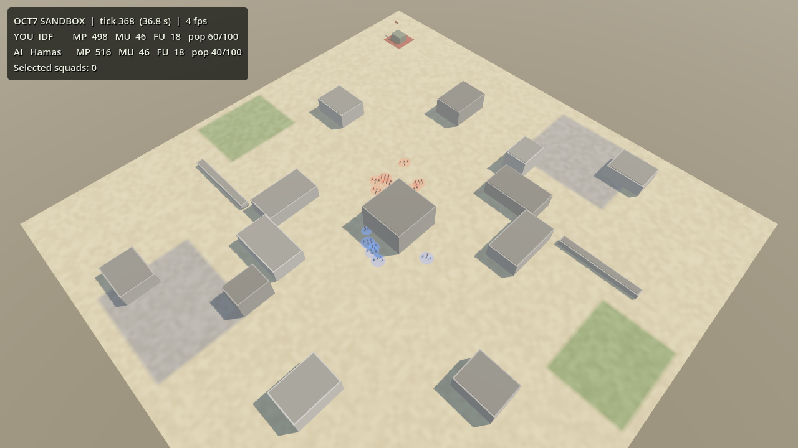
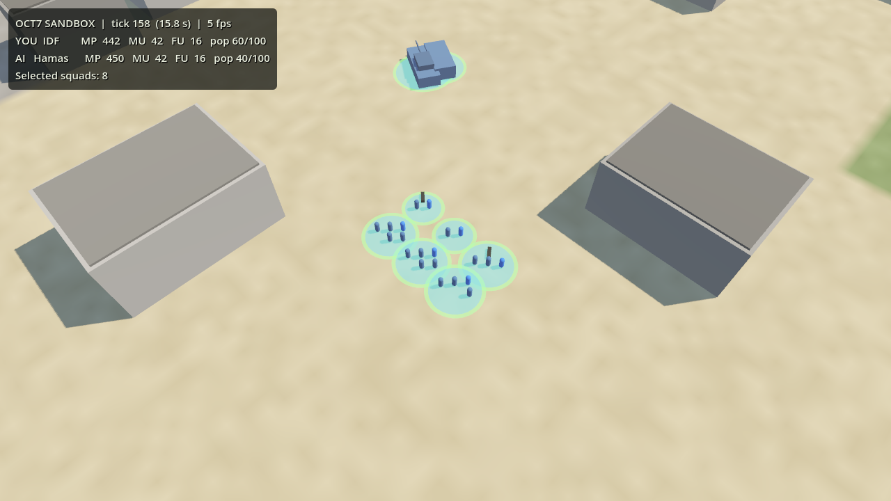

# Iron Swords: Frontlines (codename OCT7)

A squad-based tactical RTS in the Company of Heroes tradition, set in modern Middle East warfare. It has three asymmetric factions:

| Faction | Identity | Signature systems |
|---|---|---|
| **IDF** | Precision & combined arms | Merkava + Trophy APS, Iron Dome, Intel-driven air strikes, K9 & drones |
| **Hamas** | The Underground | Tunnel network, ambush & stealth, IED/EFP, rockets, quadcopters |
| **Hezbollah** | Defense in depth & firepower | Kornet ATGMs, fortified hills, Rocket Stockpile, layered anti-air |

> **Working title** *Iron Swords: Frontlines* is a placeholder.



## Status
**M0 Foundations is done.** This is a playable skeleton:
- A deterministic C# simulation: 10 Hz tick, commands, A* pathfinding, movement, economy, data-driven units.
- A Godot 4.5.1 .NET sandbox: RTS camera, selection, right-click move, debug HUD.
- 32 unit tests, an AI-vs-AI batch runner and CI.

Next up is **M1: core combat** (cover, suppression, retreat, sectors, squad combat). See [docs/09](docs/09-production-roadmap.md).



## Getting started

### Play the sandbox locally
1. Install **Godot 4.5.1 .NET** (the ".NET" download, not the standard one) and the **.NET 8 SDK**.
2. Open `game/project.godot` in Godot, then press **F5**.
3. Controls:

   | Input | Action |
   |---|---|
   | WASD / arrows / screen edge | Pan |
   | Mouse wheel | Zoom |
   | Q / E | Rotate |
   | Left click / drag | Select |
   | Shift + click | Add to selection |
   | Ctrl + A | Select all |
   | Right click | Move |

   You play IDF (blue). The Hamas AI (red) advances toward you.

### Develop (locally or in Claude Code cloud sessions)
```bash
dotnet build OCT7.sln                                    # sim + tests + tools + game assembly
dotnet test tests/OCT7.Sim.Tests                         # unit tests
dotnet run --project tools/MatchRunner -- --matches 20 --verify-determinism   # AI-vs-AI batch
godot --headless --path game -- --smoke-test 600         # run the real game headless
```
In Claude Code cloud sessions, `.claude/hooks/session-start.sh` installs .NET 8, Godot and the software renderers automatically, so Claude can build, test, run and **screenshot** the game. Project rules for Claude are in [CLAUDE.md](CLAUDE.md).

### Repository layout
| Path | Contents |
|---|---|
| `sim/` | All game rules. Pure C#, no engine references, deterministic |
| `tests/` | xUnit tests for the sim |
| `tools/MatchRunner/` | Headless AI-vs-AI batch runner |
| `game/` | Godot project (presentation only) |
| `game/data/` | All balance data (JSON) |
| `docs/` | Game design documents (source of truth) |

## Solo V1 at a glance
- **Mode:** 1v1 skirmish vs AI. Three difficulty levels: **Easy (Recruit) / Normal (Veteran) / Hard (Elite)**.
- **Factions:** all three, with about 10 units each. IDF vs Hamas is built first, then Hezbollah.
- **Base building:** HQ + 3 tech tiers, defenses and faction-unique structures (tunnels, Iron Dome, rocket depots, bunkers).
- **Special weapons:** 2 per faction (precision strike, bunker-buster, rocket salvo, tunnel bomb, Burkan, Fadi).
- **Pre-match loadout:** 1 doctrine and 1 hero per faction.
- **Progression:** unit veterancy (Vet 0–3) and hero levels (Lv 1–5).
- **Content:** 2 maps.
- **Voices:** AI text-to-speech (TTS) in Hebrew, Gazan Arabic and Lebanese Arabic, with English subtitles. Scripts are reviewed by native speakers.
- **Later:** cinematics, campaign, multiplayer, full rosters, second doctrine and hero per faction.

## Engine
**Godot 4.5.1 (.NET / C#)**, with all game rules in a **pure C# simulation library** that runs and tests headless.
- Claude Code can build, test, run and screenshot everything in the cloud.
- The engine is free, with an MIT license.
- The rules stay portable to Unity if a team joins later.

Details: [docs/08-engine-and-technology.md](docs/08-engine-and-technology.md).

## Design documents
| # | Document | Contents |
|---|---|---|
| 01 | [Vision & Scope](docs/01-vision-and-scope.md) | Pillars, solo V1 scope, content & platform rules, open decisions |
| 02 | [Core Gameplay](docs/02-core-gameplay.md) | Economy, territory, combat model, cover, suppression, detection, destruction, win conditions |
| F1 | [Faction — IDF](docs/factions/idf.md) | V1 core roster + full vision: mechanics, tech tree, units, specials, doctrines, heroes |
| F2 | [Faction — Hamas](docs/factions/hamas.md) | Same structure |
| F3 | [Faction — Hezbollah](docs/factions/hezbollah.md) | Same structure |
| 03 | [Veterancy & Heroes](docs/03-veterancy-and-heroes.md) | XP model, vet bonuses, hero progression & abilities |
| 04 | [AI & Difficulty](docs/04-ai-and-difficulty.md) | AI architecture, difficulty parameters, MatchRunner tooling |
| 05 | [Maps](docs/05-maps.md) | Map pool, layout rules, ground types |
| 06 | [Audio, Voice & Cinematics](docs/06-audio-voice-cinematics.md) | TTS voice plan, bark system, music, cinematics roadmap |
| 07 | [UI / UX](docs/07-ui-ux.md) | HUD, controls, overlays, localization (RTL), onboarding |
| 08 | [Engine & Technology](docs/08-engine-and-technology.md) | Godot vs Unity for solo, architecture, cloud workflow, tools, assets, licensing |
| 09 | [Production Roadmap](docs/09-production-roadmap.md) | Solo milestones, budget, weekly rhythm, risks, status and next steps |

All numbers in the docs and `game/data/` are **initial tuning values**.
